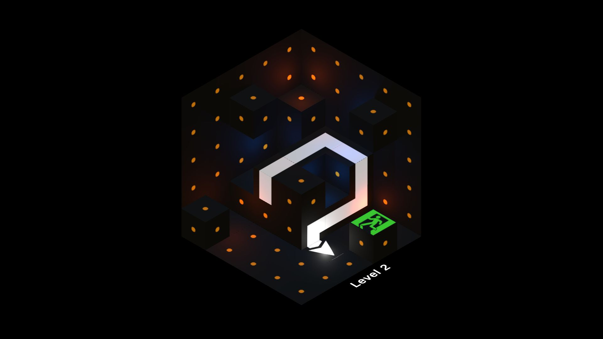

# Arrow Escape
<table>
    <tr>
        <td></td>
        <td></td>
    </tr>
<table>

A simple puzzle game where you need to reach an exit point.

This game is designed around projection mapping. By that I mean it should be projected on a wooden contruction. 3D model of which is included as OBJ file.

## Trivia
Back in 2014, or something like that, the film production company [Robureau](https://www.instagram.com/robureau) wanted to participate in an exhibition event. Theme of the event was centered around future technologies. Robureau wanted show posable ways of using interactive projection mapping. They came up with an idea of a puzzle game projected onto something.

Our common friend [Aleksander Ambalov](https://www.instagram.com/alex.ambalov/) took roles of a game designer and an artist. Then they asked me to build this game on any technology I knew at the time. The technology came up to be [**Blender**](https://blender.org) and specifically **Blender Game Engine**. I guess we made a whole thing in 10 days. 10 levels with 3 variants to each, all art, renders included. BGE builds were unstable, they crashed a lot, but from the editor itself it worked pretty ok. The base level was build with three sheets of plywood, children's toy cubes, and dark gray spray paint. We managed to build this instalation successfully and participated in the event.

Time passed. We forgot that this piece of software exists. However, a couple month ago I found the sources. I got an idea to port it to something more modern. I've been working in [**Unity**](https://unity.com/) for a couple years now so I choose this game engine. Here is my working build of **Arrow Escape**.

## Original images
<table>
    <tr>
        <td></td>
        <td></td>
        <td></td>
    </tr>
<table>

## Credits
* Producer - Rodion Zhabrev (Robureau)
* Art & game design - Aleksander Ambalov
* Developer - Aleksei Mitrofanov

## Build scripts
This project also includes [build scripts](./Assets/Scripts/Build). Which allow to auto update project version, build it and zip it in the end with proper name.

The project uses semantic versioning. The project versioning based on GIT tag system. To be able to use GIT tags as base I used scripts from [Red Blue Games](https://blog.redbluegames.com/version-numbering-for-games-in-unity-and-git-1d05fca83022).

In order to use this feature you mast clone the repo. Or initialize GIT repo inside the project folder, commit files and add a tag.
